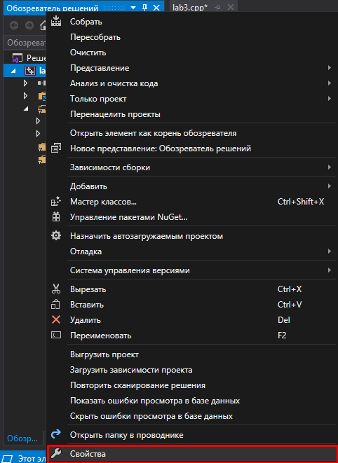
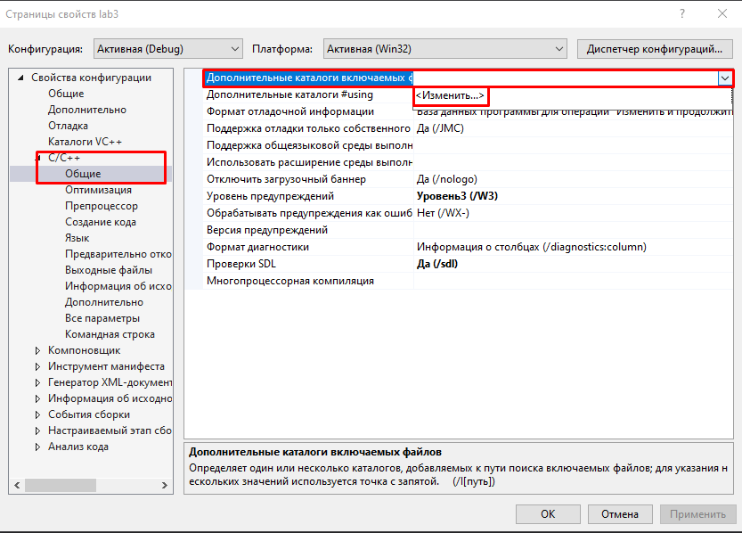
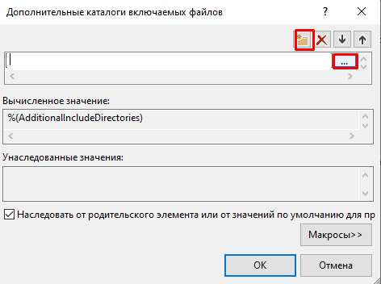
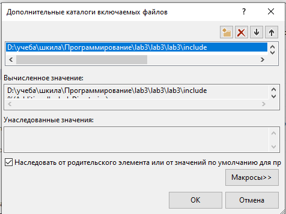
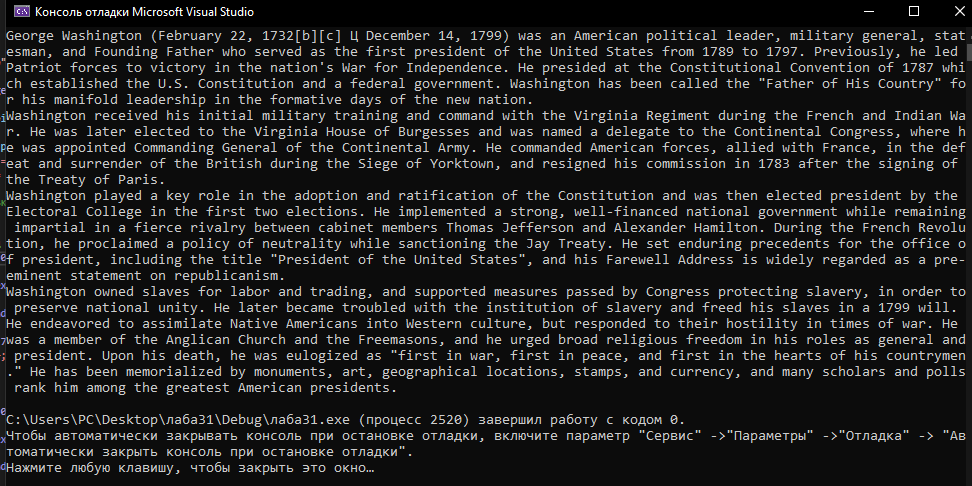

МИНИСТЕРСТВО НАУКИ  И ВЫСШЕГО ОБРАЗОВАНИЯ РОССИЙСКОЙ ФЕДЕРАЦИИ  

Федеральное государственное автономное образовательное учреждение высшего образования  

"КРЫМСКИЙ ФЕДЕРАЛЬНЫЙ УНИВЕРСИТЕТ им. В. И. ВЕРНАДСКОГО"  

ФИЗИКО-ТЕХНИЧЕСКИЙ ИНСТИТУТ  

Кафедра компьютерной инженерии и моделирования
<br/><br/>
### Отчёт по лабораторной работе № 3<br/> по дисциплине "Программирование"
<br/>
​Cтудента 1 курса группы ПИ-б-о-192(1)<br/>
Гусько Елизавета Викторовна<br/>
направления подготовки 09.03.04 "Программная инженерия"  
<br/>


<br/>
<table>

<tr><td>Научный руководитель<br/> старший преподаватель кафедры<br/> компьютерной инженерии и моделирования</td>

<td>(оценка)</td>

<td>Чабанов В.В.</td>

</tr>

</table>

<br/><br/>

​

Симферополь, 2020

<br/>

# Лабораторная работа №3

# Дешифровка текста из изображения

### ***Цель***: 
1. Закрепить навыки разработки программ использующих операторы цикла;
2. Закрепить навыки разработки программ использующих массивы;
3. Освоить методы подключения сторонних библиотек.

<br/>

### ***Постановка задачи*** 
Напишите на языке С++ программу, которая по заданному изображению и ключу восстанавливает исходное текстовое сообщение (Си-строка) зашифрованное в изображении.
<br/>

Для начала скачиваем наше изображение и узнаем наш ключ (Вариант 1 - 11r 11g 11b 01r 01g 01b 10r 10g).

 <br/>
>Рисунок 1. Данное изображение.

1.Для того чтобы работать с изображениями в формате ***bmp***, скачала библиотеку https://github.com/marc-q/libbmp;
2. Из скаченного репозитория в папке **CPP** лежат файлы, которые я добавила в проект;
3. Добавляем файл **libbmp.cpp** к проекту;
4. Затем в проекте создала папку **include**, в которую копируем файл **libbmp** из репозитория;
5. В *"Обозреватель решений"* открыла *"Свойства"* 


>Рисунок 2. Открытие свойств проекта
6. В *"Свойства конфигурации"* открыла вкладку *"С/С++"*, а в ней *"Общие"* > *"Дополнительные каталоги включаемых файлов"* > нажала на стрелочку в конце > *"Изменить"* 


>Рисунок 3. Дополнительные каталоги
7. В появившемся окне кликнула на иконку с изображением папки, а затем на появившиеся троеточия;


>Рисунок 4. Добавление доп. каталогов
8. Указала путь к папке **include** *(рис.6)*;


>Рисунок 5. Путь к папке *include*
9. Подключила библиотеку в свой проект. Для этого я использовала команду :
```c++
#include "libbmp.h"
```
10. Декодировала сообщение и вывела его в консоль *(рис.7)*;

```c++
#include <iostream>
#include "libbmp.h"

short Bit = 7;  // Переменная, хранящая номер текущего читаемого бита
short Byte = 0; // Переменная, хранящая номер текущего читаемого байта
char text[5000]; // Массив, хронящий полученный текст
bool end = false;

int main()
{
	BmpImg pic;
	pic.read("pic1.bmp");

	for (int y = pic.get_height() - 1; y >= 0; y--)  // 11r 11g 11b 01r 01g 01b 10r 10g
	{
		for (int x = pic.get_width() - 1; x >= 0; x--)
		{
			int red = pic.red_at(x, y) & 0b1;
			int green = pic.green_at(x, y) & 0b1;
			int blue = pic.blue_at(x, y) & 0b1;
			
			// Установка бита в нужную позицию при помощи сдвига
			text[Byte] |= red<< Bit--;

			// Переход к следующему байту
			if (Bit < 0)
			{
				if (text[Byte] == '\0')
				{
					end = true;
				}
				Bit = 7;
				Byte++;
			}

			text[Byte] |= green << Bit--;

			if (Bit < 0)
			{
				if (text[Byte] == '\0')
				{
					end = true;
				}
				Bit = 7;
				Byte++;
			}

			text[Byte] |= blue << Bit--;

			if (Bit < 0)
			{
				if (text[Byte] == '\0')
				{
					end = true;
				}
				Bit = 7;
				Byte++;
			}
			
			if (end) break;
		}
		if (end) break;
	}

	std::cout << text << "\n";
}
```
Полученное сообщение: 


>Рисунок 3. Полученный текст

### Вывод: я научилась декодировать изображение по данному ключу.
